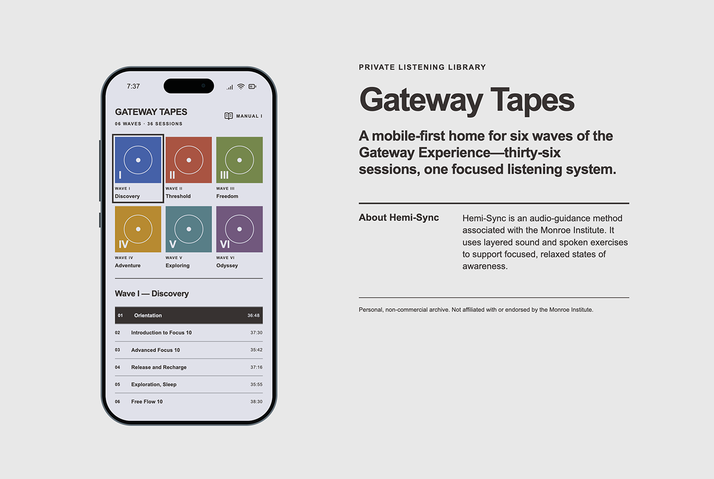
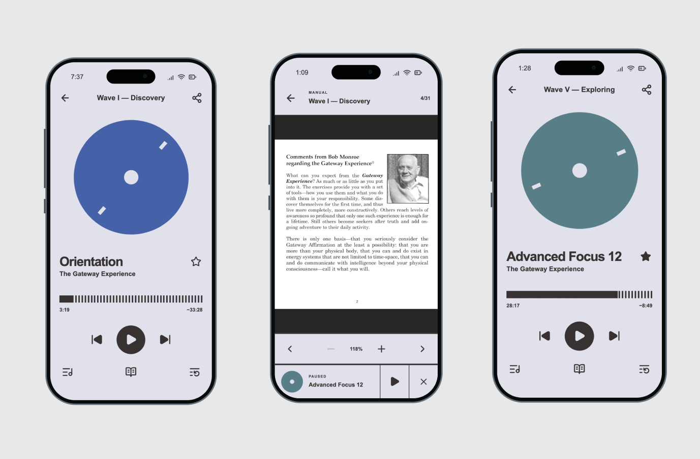

# Gateway Tapes

A mobile-first, lossless listening archive designed around focus, clarity, and the discipline of Swiss International Style.

[Open the live application](https://gateway.cows.wtf/)



## The vision

Gateway Tapes began as a personal hobby project: a focused home for a collection of long-form audio sessions and their companion manuals.

The player avoids the visual noise of conventional streaming applications. Its interface is grid-first, typographic, and deliberately restrained—high contrast, left-aligned type, no gradients, no decorative shadows, and no unnecessary controls. A single rotating disc anchors the experience while the recording remains the focus.

The result is an installable web application that feels closer to a dedicated listening device than a media website.



## What the player does

- Organizes six waves and 36 listening sessions in a compact mobile library.
- Streams original lossless FLAC files from Cloudflare R2 with HTTP range support.
- Uses bounded stream segments and automatically reconnects at the same position after a stalled mobile connection.
- Starts a selected session immediately from the beginning.
- Provides speed-responsive scratch audio and supported-device haptics while disc scrubbing, plus a stable seek rail and ten-second rewind/forward controls.
- Keeps a persistent mini player when moving between the library, player, and manuals.
- Saves playback position, favorites, and the current session on the device.
- Downloads the current original-quality FLAC through the authenticated media route.
- Includes a landscape-friendly PDF manual reader with rendered-page fallbacks.
- Supports passwordless email access through Clerk.
- Installs as a Progressive Web App on a phone home screen.
- Uses a responsive desktop presentation while keeping the listening interface mobile-first.

## Technology

- React 19 and Next.js-compatible routing through [vinext](https://github.com/cloudflare/vinext)
- Cloudflare Workers for the application runtime
- Cloudflare R2 for lossless recordings, PDF manuals, and rendered manual pages
- Cloudflare D1 for media metadata and registered-user records
- Clerk for email one-time-code authentication
- PostHog for privacy-conscious product analytics
- Lucide for the interface icon system

## Analytics

The optional PostHog integration identifies signed-in listeners with their stable Clerk user ID and email, then records a deliberately small set of product events: archive loads, wave and session selection, playback starts, pauses, completion, buffering, recovery attempts and errors, seeks and ten-second skips, manual opens, favorites, sharing, and download starts.

Autocapture and session recording are disabled. Audio, manual contents, form fields, playback ticks, and credentials are never sent. Analytics uses browser local storage rather than cookies and remains completely inactive unless both PostHog values are configured.

Create a PostHog project, then add these public client-side values to the local and hosted environments:

```bash
NEXT_PUBLIC_POSTHOG_PROJECT_TOKEN=phc_your_project_token
NEXT_PUBLIC_POSTHOG_HOST=https://us.i.posthog.com
```

Use the EU ingestion host instead if the PostHog project was created in the EU region.

## Project structure

```text
app/                    Application pages, player, reader, and API routes
db/                     D1 and R2 access helpers
drizzle/                Database migrations
public/                  PWA icons, service worker, and static assets
scripts/                 R2 verification and media-upload utilities
tests/                   Build and route checks
wrangler.direct.jsonc    Direct Cloudflare Worker configuration
```

## Run locally

Node.js 22.13 or newer is required.

```bash
npm install
cp .env.example .env
npm run dev
```

Add your own credentials to `.env`. Environment files are ignored by Git and must never be committed.

## Verify and build

```bash
npm test
npm run r2:check
npm run r2:verify-audio
npm run r2:verify-audio:decode
npm run build
```

## Deploy to Cloudflare

```bash
node --env-file=.env node_modules/wrangler/bin/wrangler.js deploy --config wrangler.direct.jsonc
```

The Cloudflare configuration expects these existing bindings:

- `MEDIA` — an R2 bucket containing the private media archive
- `DB` — a D1 database for media and access metadata

## Media and privacy

Recordings, manuals, user data, and credentials are intentionally not included in this repository. The source expects media to be supplied privately through R2 by someone who has the right to use it.

Protected media routes require a valid Clerk session. Direct R2 credentials remain server-side and are never sent to the browser.

## Disclaimer

This is a personal, non-commercial archive and an independent interface-design project. It is not affiliated with or endorsed by the Monroe Institute. Hemi-Sync and related names belong to their respective owners.
